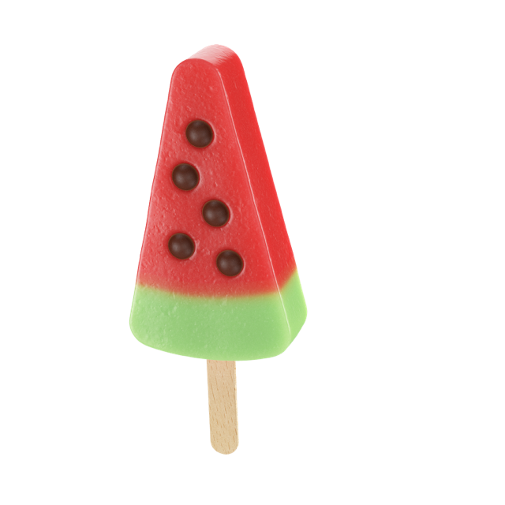

# Foreldre kontroll: kan jeg få is?
En app der styrer barneoppdragelsen for dig mens du feirer nationaldagen og koser dig 

OBS: desverre er det ikke plass på github til å laste opp selve zip filen med appen. 

## For å produsere appen selv:

```
npm install
npm run make 
```




## idé og pseudokode
Jeg vil lage en app, som forhindrer norske barn i å spise for mye is på 17 mai. Det skal være et stort bilde av en is......

### fremgangsmåte

- først vil jeg vise et bilde av en is
- så vil jeg gøre sånn at når det klikkes på bildet, blir funksjonen "sjekkIs" kallt
- Appen må... 
 - vise barna om de kan eller ikke kan få is 
   - jeg oppretter et interval time, som holder øye med hva klokken er hvert sekund
   - jeg oppretter en annen tidsvariabel, alarm, som settes til 1970 når app'en starter
   - jeg oppretter en variabel 'kanjegfaais' som er sand hvis alarm er mindre enn variablen time, men falsk hvis alarmen er større
   - til å begjynne med er alarmen mindre - atlså kan barna få is - 
   - første gang det klikkes vises et bilde av et flagg, hurra, og barna kan få is
   - MEN samtidig settes alarm variablen = nå pluss en halv time
   - nå er alarm altså større enn variablen time 
   - hvis barna klikker før den halve time har gått, får de en lei beskjed og et bilde som viser at de nå må vente enda længere
   - samtidig settes alarmen enda en halv time frem
   - hvis barna har ventet en halv time har alarm igjen blitt mindre enn variablen time og barna kan få is
   - osv   
   - Bilder og beskjeder (kan/kanikke få is) i funksjonen faaIs, må bare vises fem sekunder. Til dette brukes setTimeout() samt en variabel, visBeskjed 

